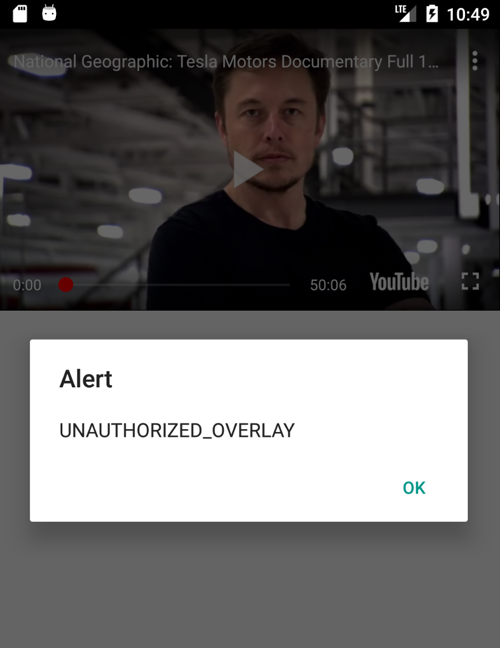

# How to run
```bash
npm install
react-native link
react-native run-android
```

You need youtube app in the emulator. You can download it [here](https://www.apkmirror.com/apk/google-inc/youtube/) and install it using `adb`  

# The problem is

Below is the screenshot when the app is launched. Youtube player does not work well because of overlay layout of `react-native-navigation`.

You can check on this UNAUTHORIZED_OVERLAY issue [here](https://github.com/inProgress-team/react-native-youtube#unauthorized_overlay-and-player_view_too_small-on-android).


